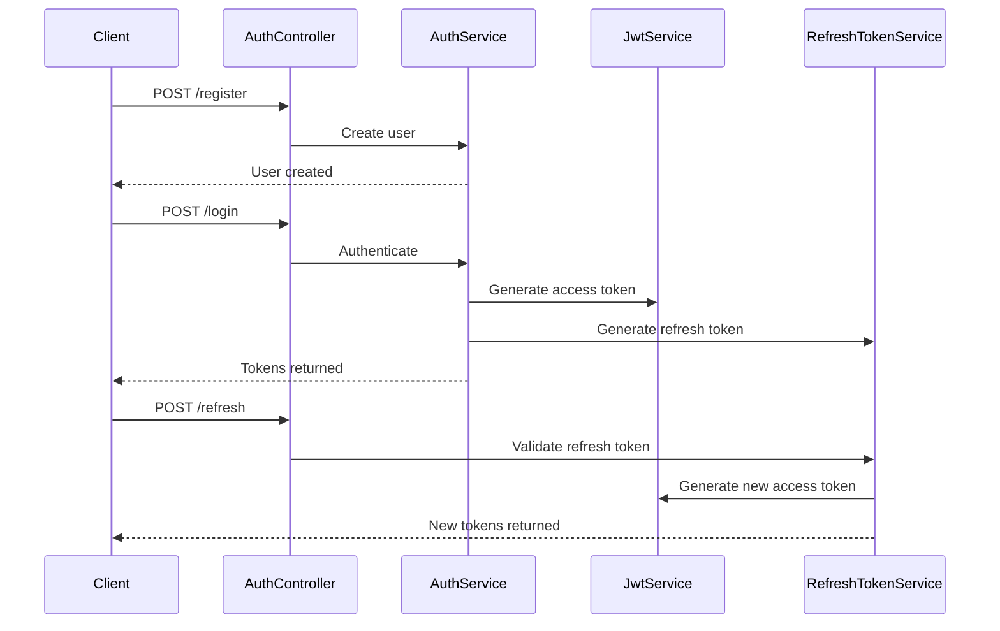

# Authentication Module - Complete API Documentation

This document provides comprehensive documentation for the Authentication Module, including all endpoints, request/response examples, and security details.

## Table of Contents

- [Overview](#overview)
- [Authentication Flow](#authentication-flow)
- [API Endpoints](#api-endpoints)
- [Request/Response Examples](#requestresponse-examples)
- [Error Handling](#error-handling)
- [Security Considerations](#security-considerations)
- [Integration Examples](#integration-examples)

## Overview

The Authentication Module handles user authentication, registration, and token management for the Smart Parking system. It provides JWT-based authentication with refresh token support.

### Key Features

- **User Registration**: Create new user accounts with default USER role
- **User Login**: Authenticate users and receive JWT tokens
- **Token Refresh**: Refresh expired access tokens using refresh tokens
- **JWT Security**: Secure token-based authentication
- **Role-Based Access**: Integration with role and permission system

### Security Model

- **Public Endpoints**: Registration, login, and token refresh (no authentication required)
- **JWT Tokens**: Access tokens with configurable expiration
- **Refresh Tokens**: Long-lived tokens for token renewal
- **Password Security**: Secure password handling and validation

## Authentication Flow



## API Endpoints

Base URL: `/api/v1/auth`

### 1. User Registration

**POST** `/api/v1/auth/register`

Creates a new user account with default USER role.

**Request Body:**
```json
{
  "firstName": "John",
  "lastName": "Doe",
  "username": "johndoe",
  "password": "SecurePassword123!",
  "confirmPassword": "SecurePassword123!",
  "email": "john.doe@example.com",
  "phoneNumber": "+355 69 123 4567"
}
```

**Response (201 Created):**
```json
{
  "success": true,
  "message": "Registration successful",
  "data": {
    "id": 1,
    "firstName": "John",
    "lastName": "Doe",
    "username": "johndoe",
    "email": "john.doe@example.com",
    "phoneNumber": "+355 69 123 4567",
    "roles": ["USER"],
    "permissions": [
      "BOOKING_READ",
      "BOOKING_CREATE",
      "BOOKING_UPDATE",
      "BOOKING_DELETE",
      "SESSION_READ",
      "SESSION_CREATE",
      "SESSION_UPDATE",
      "SESSION_DELETE",
      "CAR_READ",
      "CAR_CREATE",
      "CAR_UPDATE",
      "CAR_DELETE"
    ],
    "isActive": true,
    "createdAt": "2024-01-15T10:30:00Z",
    "updatedAt": "2024-01-15T10:30:00Z"
  }
}
```

**cURL Example:**
```bash
curl -X POST "http://localhost:8080/api/v1/auth/register" \
  -H "Content-Type: application/json" \
  -d '{
    "firstName": "John",
    "lastName": "Doe",
    "username": "johndoe",
    "password": "SecurePassword123!",
    "confirmPassword": "SecurePassword123!",
    "email": "john.doe@example.com",
    "phoneNumber": "+355 69 123 4567"
  }'
```

### 2. User Login

**POST** `/api/v1/auth/login`

Authenticates a user and returns JWT access token and refresh token.

**Request Body:**
```json
{
  "username": "johndoe",
  "password": "SecurePassword123!"
}
```

**Response (200 OK):**
```json
{
  "success": true,
  "message": "Login successful",
  "data": {
    "accessToken": "eyJhbGciOiJIUzI1NiIsInR5cCI6IkpXVCJ9...",
    "refreshToken": "eyJhbGciOiJIUzI1NiIsInR5cCI6IkpXVCJ9...",
    "tokenType": "Bearer",
    "expiresIn": 3600,
    "refreshExpiresIn": 604800,
    "issuedAt": 1705312200000
  }
}
```

**cURL Example:**
```bash
curl -X POST "http://localhost:8080/api/v1/auth/login" \
  -H "Content-Type: application/json" \
  -d '{
    "username": "johndoe",
    "password": "SecurePassword123!"
  }'
```

### 3. Token Refresh

**POST** `/api/v1/auth/refresh`

Refreshes an expired access token using a valid refresh token.

**Request Body:**
```json
{
  "refreshToken": "eyJhbGciOiJIUzI1NiIsInR5cCI6IkpXVCJ9..."
}
```

**Response (200 OK):**
```json
{
  "success": true,
  "message": "Access token refreshed successfully",
  "data": {
    "accessToken": "eyJhbGciOiJIUzI1NiIsInR5cCI6IkpXVCJ9...",
    "refreshToken": "eyJhbGciOiJIUzI1NiIsInR5cCI6IkpXVCJ9...",
    "tokenType": "Bearer",
    "expiresIn": 3600,
    "refreshExpiresIn": 604800,
    "issuedAt": 1705312200000
  }
}
```

**cURL Example:**
```bash
curl -X POST "http://localhost:8080/api/v1/auth/refresh" \
  -H "Content-Type: application/json" \
  -d '{
    "refreshToken": "eyJhbGciOiJIUzI1NiIsInR5cCI6IkpXVCJ9..."
  }'
```

## Request/Response Examples

### Registration Validation

**Invalid Request (400 Bad Request):**
```json
{
  "success": false,
  "message": "Username and password are required",
  "data": null
}
```

**Duplicate Username (409 Conflict):**
```json
{
  "success": false,
  "message": "Username already exists",
  "data": null
}
```

### Login Validation

**Invalid Credentials (401 Unauthorized):**
```json
{
  "success": false,
  "message": "Invalid username or password",
  "data": null
}
```

**Missing Fields (400 Bad Request):**
```json
{
  "success": false,
  "message": "Username and password are required",
  "data": null
}
```

### Token Refresh Validation

**Invalid Refresh Token (401 Unauthorized):**
```json
{
  "success": false,
  "message": "Invalid refresh token",
  "data": null
}
```

**Expired Refresh Token (401 Unauthorized):**
```json
{
  "success": false,
  "message": "Refresh token expired",
  "data": null
}
```

## Error Handling

### Common Error Responses

| Status Code | Error Type | Description |
|-------------|------------|-------------|
| 400 | Bad Request | Missing required fields or invalid data format |
| 401 | Unauthorized | Invalid credentials or expired tokens |
| 409 | Conflict | Username or email already exists |
| 500 | Internal Server Error | Server-side error |

### Error Response Format

```json
{
  "success": false,
  "message": "Error description",
  "data": null
}
```

## Security Considerations

### Password Requirements

- Minimum 8 characters
- Must contain uppercase and lowercase letters
- Must contain numbers
- Must contain special characters
- Passwords are hashed using BCrypt

### Token Security

- **Access Tokens**: Short-lived (1 hour by default)
- **Refresh Tokens**: Long-lived (7 days by default)
- **Token Storage**: Store securely on client side
- **HTTPS**: Always use HTTPS in production

### Best Practices

1. **Client-Side Storage**: Store tokens securely (HttpOnly cookies recommended)
2. **Token Refresh**: Implement automatic token refresh before expiration
3. **Logout**: Clear tokens on logout
4. **Password Reset**: Implement password reset functionality
5. **Account Lockout**: Implement account lockout after failed attempts

## Integration Examples

### Frontend Integration (JavaScript)

```javascript
class AuthService {
  constructor() {
    this.baseURL = 'http://localhost:8080/api/v1/auth';
  }

  async register(userData) {
    const response = await fetch(`${this.baseURL}/register`, {
      method: 'POST',
      headers: {
        'Content-Type': 'application/json',
      },
      body: JSON.stringify(userData)
    });
    return response.json();
  }

  async login(credentials) {
    const response = await fetch(`${this.baseURL}/login`, {
      method: 'POST',
      headers: {
        'Content-Type': 'application/json',
      },
      body: JSON.stringify(credentials)
    });
    const result = await response.json();
    
    if (result.success) {
      localStorage.setItem('accessToken', result.data.accessToken);
      localStorage.setItem('refreshToken', result.data.refreshToken);
    }
    
    return result;
  }

  async refreshToken() {
    const refreshToken = localStorage.getItem('refreshToken');
    const response = await fetch(`${this.baseURL}/refresh`, {
      method: 'POST',
      headers: {
        'Content-Type': 'application/json',
      },
      body: JSON.stringify({ refreshToken })
    });
    const result = await response.json();
    
    if (result.success) {
      localStorage.setItem('accessToken', result.data.accessToken);
      localStorage.setItem('refreshToken', result.data.refreshToken);
    }
    
    return result;
  }

  getAuthHeader() {
    const token = localStorage.getItem('accessToken');
    return token ? `Bearer ${token}` : null;
  }
}
```

### Mobile Integration (React Native)

```javascript
import AsyncStorage from '@react-native-async-storage/async-storage';

class AuthService {
  async login(credentials) {
    try {
      const response = await fetch('http://localhost:8080/api/v1/auth/login', {
        method: 'POST',
        headers: {
          'Content-Type': 'application/json',
        },
        body: JSON.stringify(credentials)
      });
      
      const result = await response.json();
      
      if (result.success) {
        await AsyncStorage.setItem('accessToken', result.data.accessToken);
        await AsyncStorage.setItem('refreshToken', result.data.refreshToken);
      }
      
      return result;
    } catch (error) {
      console.error('Login error:', error);
      throw error;
    }
  }

  async getStoredToken() {
    return await AsyncStorage.getItem('accessToken');
  }

  async logout() {
    await AsyncStorage.removeItem('accessToken');
    await AsyncStorage.removeItem('refreshToken');
  }
}
```

### Backend Integration (Spring Boot)

```java
@RestController
@RequestMapping("/api/v1/protected")
public class ProtectedController {
    
    @GetMapping("/user-info")
    public ResponseEntity<ApiResponse<UserInfo>> getUserInfo(
            Authentication authentication) {
        String username = authentication.getName();
        // Get user info using username
        UserInfo userInfo = userService.getUserInfo(username);
        return ResponseHelper.ok("User info retrieved", userInfo);
    }
}
```

## Database Schema

### users table
```sql
CREATE TABLE users (
    id BIGSERIAL PRIMARY KEY,
    first_name VARCHAR(50) NOT NULL,
    last_name VARCHAR(50) NOT NULL,
    username VARCHAR(50) UNIQUE NOT NULL,
    password VARCHAR(255) NOT NULL,
    email VARCHAR(100) UNIQUE NOT NULL,
    phone_number VARCHAR(20),
    is_active BOOLEAN DEFAULT true,
    created_at TIMESTAMP DEFAULT NOW(),
    updated_at TIMESTAMP DEFAULT NOW()
);
```

### refresh_tokens table
```sql
CREATE TABLE refresh_tokens (
    id BIGSERIAL PRIMARY KEY,
    token VARCHAR(255) UNIQUE NOT NULL,
    user_id BIGINT NOT NULL REFERENCES users(id),
    expires_at TIMESTAMP NOT NULL,
    created_at TIMESTAMP DEFAULT NOW()
);
```

## Configuration

### JWT Configuration
```yaml
# application.yml
jwt:
  secret: your-secret-key
  expiration: 3600 # 1 hour in seconds
  refresh-expiration: 604800 # 7 days in seconds
```

### Security Configuration
```java
@Configuration
@EnableWebSecurity
public class SecurityConfig {
    
    @Bean
    public PasswordEncoder passwordEncoder() {
        return new BCryptPasswordEncoder();
    }
    
    @Bean
    public AuthenticationManager authenticationManager(
            AuthenticationConfiguration config) throws Exception {
        return config.getAuthenticationManager();
    }
}
```

This comprehensive documentation covers all aspects of the Authentication Module, providing developers with everything they need to integrate authentication into their applications.
